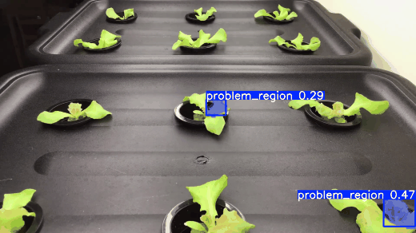
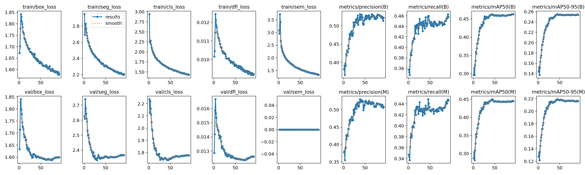
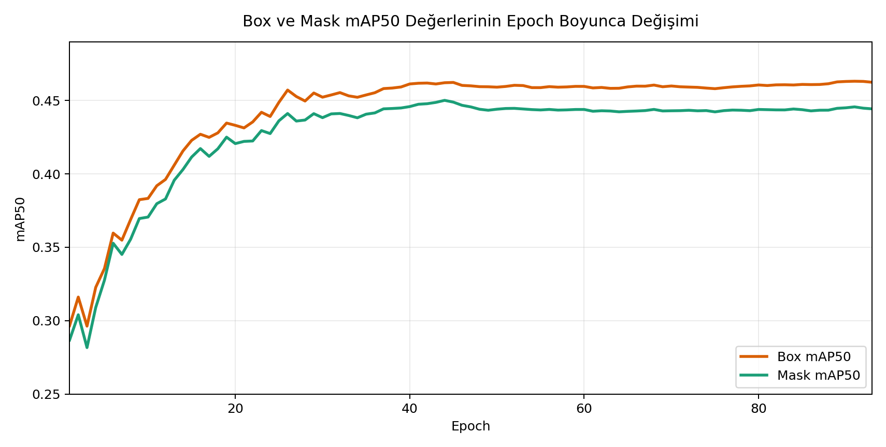
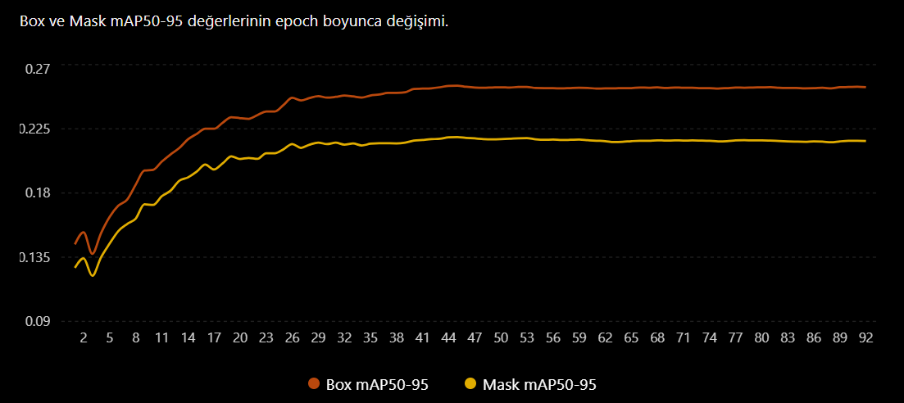
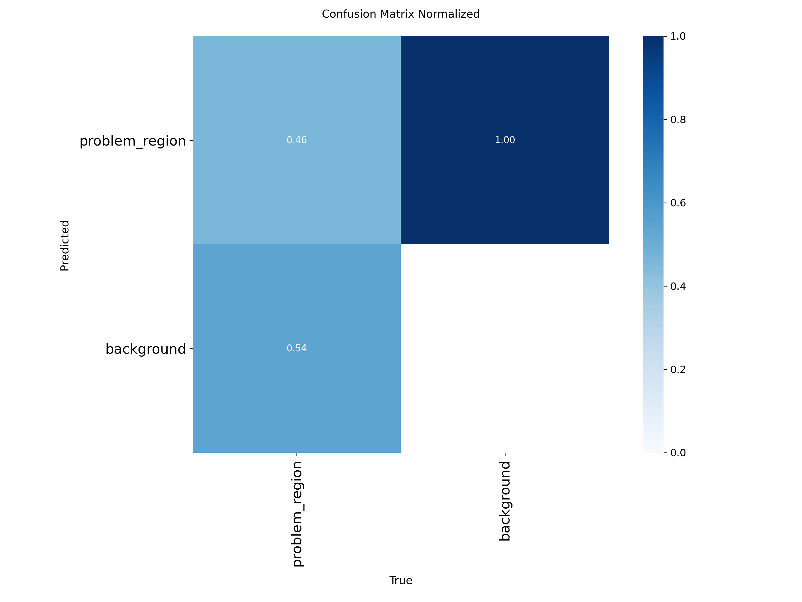
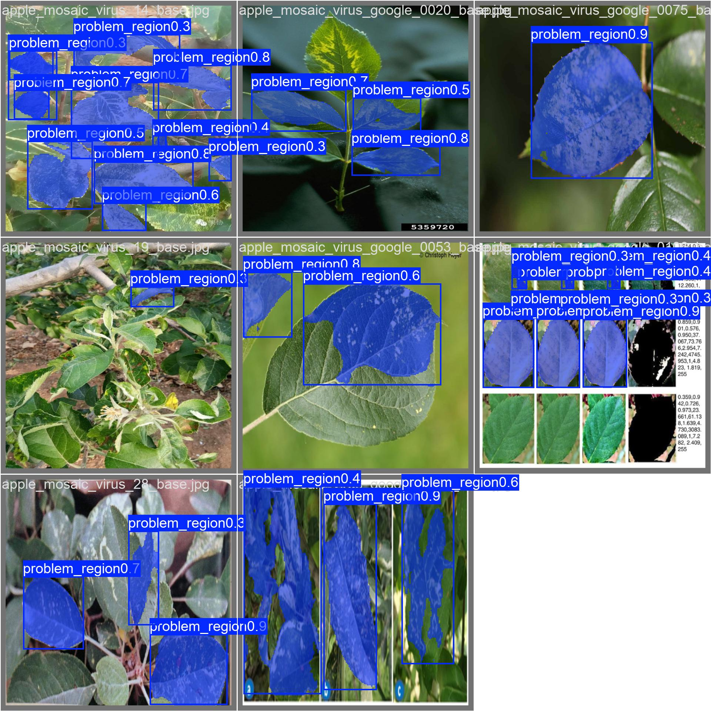
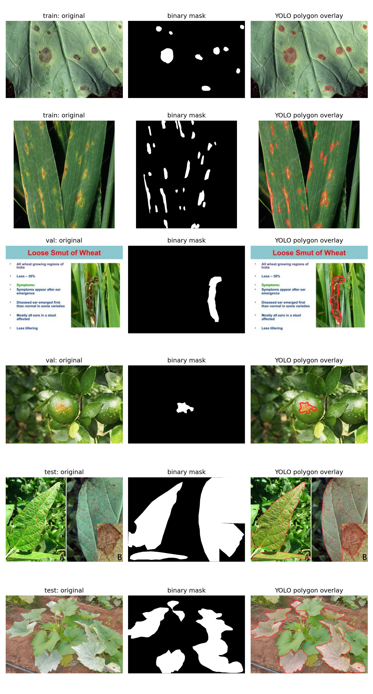
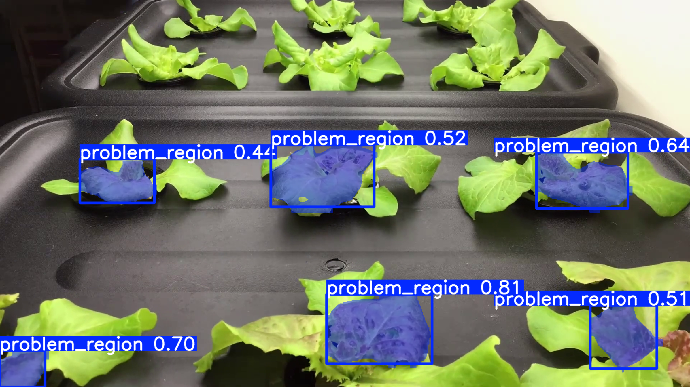

# Görüntü İşleme - PlantSeg YOLO Segmentasyon

Dikey tarım projesinin görüntü işleme bölümünde, PlantSeg veri setindeki hastalıklı veya sorunlu yaprak bölgeleri tek sınıf olarak ele alınır: `problem_region`.



## Ne Yapıldı?

- PlantSeg maske anotasyonları YOLO segmentation formatına dönüştürüldü.
- Arka plan dışındaki tüm maske pikselleri tek sınıf olarak `problem_region` kabul edildi.
- Eğitim görüntüleri 640x640 boyuta getirildi ve kontrollü augmentation uygulandı.
- Ultralytics `yolo26n-seg.pt` nano instance segmentation modeli fine-tune edilerek problemli bölge segmentasyonu eğitildi.
- Eğitilmiş model `models/best.pt` olarak bu klasöre eklendi.

## Sonuç Özeti

Doğrulama setinde eğitilmiş `best.pt` modeliyle alınan ana metrikler:

| Metrik | Değer |
| --- | ---: |
| Box mAP50 | 0.4623 |
| Box mAP50-95 | 0.2551 |
| Mask mAP50 | 0.4477 |
| Mask mAP50-95 | 0.2176 |

Modelin amacı hastalık adını sınıflandırmak değil, görüntü üzerinde sorunlu görünen bölgeyi maske olarak işaretlemektir.

## Görsel Sonuçlar

### Eğitim Grafikleri







### Değerlendirme Çıktıları





### Veri ve Video Kontrolleri





## Kurulum

```bat
python -m venv .venv
.venv\Scripts\pip install -r requirements.txt
```

## Veri Setini İndirme

Ham PlantSeg veri seti büyük olduğu için repoya eklenmez. Aşağıdaki komut Zenodo üzerinden indirir, MD5 kontrolü yapar ve `data/plantseg/` içine çıkarır.

```bat
.venv\Scripts\python.exe src\download_dataset.py
```

Mevcut dosyaları tekrar indirmeden kullanmak için:

```bat
.venv\Scripts\python.exe src\download_dataset.py --skip-existing
```

## Veri Hazırlama

PlantSeg maskelerini YOLO segmentation etiketlerine dönüştür:

```bat
.venv\Scripts\python.exe src\plantseg_to_yolo.py --overwrite
```

Train split için augmentation uygula:

```bat
.venv\Scripts\python.exe src\augment_yolo.py --overwrite
```

Varsayılan çıktılar:

```text
data\plantseg_yolo
data\plantseg_yolo_augmented
```

## Eğitim

```bat
run.bat
```

Kısa deneme eğitimi:

```bat
run.bat --epochs 3 --device cpu
```

Varsayılan eğitim ayarları:

```text
model=yolo26n-seg.pt
epochs=300
patience=30
imgsz=640
batch=auto
workers=4
cache=false
```

## Demo Tahmin

Repoya dahil edilen eğitilmiş model varsayılan olarak `models/best.pt` yolundan okunur.

```bat
.venv\Scripts\python.exe src\demo_predict.py --source path\to\video.mp4
```

Bir tahmin videosu kaydetmek için:

```bat
.venv\Scripts\python.exe src\demo_predict.py --source path\to\video.mp4 --output outputs\demo_prediction.mp4
```

Webcam için:

```bat
.venv\Scripts\python.exe src\demo_predict.py --source 0
```

## Klasör Yapısı

```text
Görüntü işleme/
  assets/              README demo GIF'i ve seçili sonuç görselleri
  models/best.pt       Eğitilmiş YOLO segmentation modeli
  src/                 Veri indirme, dönüştürme, augmentation, eğitim ve demo kodları
  README.md
  requirements.txt
  run.bat
```

## Credits

Bu çalışmada eğitilen `models/best.pt`, Ultralytics YOLO26 ailesindeki `yolo26n-seg.pt` nano instance segmentation modeli temel alınarak PlantSeg verisi üzerinde fine-tune edilmiştir.

Veri seti olarak PlantSeg kullanıldı:

- Wei, T. A large-scale in-the-wild dataset for plant disease segmentation. Zenodo, 2024. [DOI: 10.5281/zenodo.17719108](https://doi.org/10.5281/zenodo.17719108)
- Wei, T., Chen, Z. ve Yu, X. A Large-Scale In-the-wild Dataset for Plant Disease Segmentation. Scientific Data, 2026. [Makale](https://www.nature.com/articles/s41597-025-06513-4)

Model eğitimi ve tahmin akışı Ultralytics YOLO26 ile hazırlanmıştır:

```bibtex
@software{yolo26_ultralytics,
  author = {Glenn Jocher and Jing Qiu},
  title = {Ultralytics YOLO26},
  version = {26.0.0},
  year = {2026},
  url = {https://github.com/ultralytics/ultralytics},
  orcid = {0000-0001-5950-6979, 0000-0003-3783-7069},
  license = {AGPL-3.0}
}
```

Ultralytics YOLO26 dokümantasyonu ve lisans bilgileri: [Ultralytics YOLO26 Docs](https://docs.ultralytics.com/models/yolo26).
